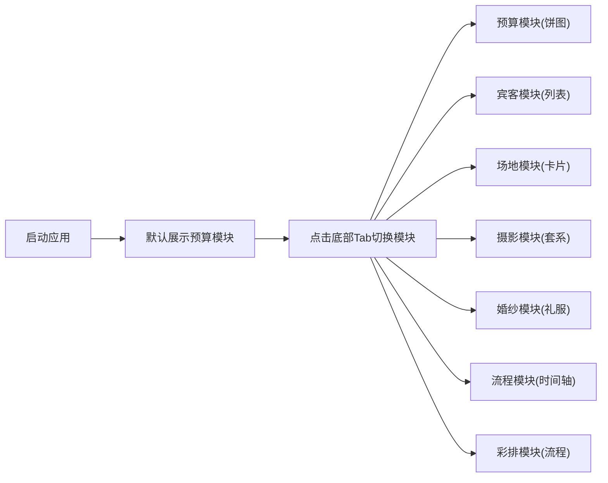

## 1. 产品概述
婚礼管家 H5 是一款面向新婚夫妇的全流程婚礼规划管理工具，帮助用户系统化地管理婚礼筹备的各个环节。
- 核心价值：一站式解决婚礼预算、宾客、场地、摄影、婚纱、流程、彩排等全维度管理需求
- 目标用户：准备结婚的年轻夫妇，追求高效、有条理的婚礼筹备体验

## 2. 核心功能

### 2.1 用户角色
| 角色 | 注册方式 | 核心权限 |
|------|----------|----------|
| 普通用户 | 无需注册（本地存储） | 浏览、编辑、管理所有婚礼筹备模块数据 |

### 2.2 功能模块
1. **预算模块**：可视化饼图展示各项支出占比，预算总额与实际支出对比
2. **宾客模块**：宾客名单管理，出席状态、座位安排、联系方式
3. **场地模块**：婚礼场地信息、档期、费用、联系方式管理
4. **摄影模块**：摄影团队预约、拍摄风格、套系选择、照片管理
5. **婚纱模块**：婚纱礼服选择、试穿记录、尺寸信息、费用管理
6. **流程模块**：婚礼当日时间轴安排，各项仪式节点管理
7. **彩排模块**：彩排流程、人员分工、注意事项管理

### 2.3 页面详情
| 页面名称 | 模块名称 | 功能描述 |
|----------|----------|----------|
| 预算页 | 饼图展示 | 分类支出饼图、总额统计、预算执行进度 |
| 宾客页 | 宾客列表 | 分组展示、出席状态筛选、搜索、新增编辑 |
| 场地页 | 场地卡片 | 场地列表、详情展示、预约状态、费用对比 |
| 摄影页 | 摄影套系 | 团队介绍、样片展示、套系价格、拍摄档期 |
| 婚纱页 | 礼服管理 | 礼服分类、试穿记录、尺寸参数、费用明细 |
| 流程页 | 时间轴 | 婚礼当日时间节点、事项安排、负责人、提醒 |
| 彩排页 | 彩排流程 | 彩排时间、流程步骤、人员分工、注意事项 |

## 3. 核心流程
用户打开应用后，通过底部 Tab 栏在七个模块间自由切换。每个模块独立展示和管理对应的数据，数据本地持久化存储。

## 4. 用户界面设计

### 4.1 设计风格
- **主色调**：浪漫玫瑰粉 #FF8BA7，搭配象牙白 #FFFBF5 和香槟金 #E8C4A0
- **辅助色**：莫兰迪紫 #B8A9C9、薄荷绿 #9ED2BE
- **按钮风格**：圆角胶囊形，柔和阴影，点击有微缩动效
- **字体**：标题使用优雅衬线体，正文使用圆润无衬线体
- **布局风格**：卡片式布局，柔和圆角，细腻阴影，充分留白
- **图标风格**：线性描边图标，统一 2px 线条，颜色与主色调呼应

### 4.2 页面设计概览
| 页面名称 | 模块名称 | UI 元素 |
|----------|----------|----------|
| 预算页 | 饼图展示 | 圆形饼图带彩色图例、数据卡片网格、渐变背景 |
| 宾客页 | 宾客列表 | 搜索栏、分组标签、列表项带头像、状态徽章 |
| 场地页 | 场地卡片 | 场地图片轮播、评分星级、价格标签、状态标识 |
| 摄影页 | 摄影套系 | 团队头像、作品网格、套系选项卡、预约按钮 |
| 婚纱页 | 礼服管理 | 分类标签、礼服卡片、尺寸参数表、试穿时间线 |
| 流程页 | 时间轴 | 垂直时间轴、时间节点卡片、动画连接线 |
| 彩排页 | 彩排流程 | 步骤序号、分工卡片、注意事项折叠面板 |

### 4.3 响应式设计
- 移动优先设计，适配 320px - 480px 手机屏幕
- 底部 Tab 栏固定，高度 64px，安全区适配
- 内容区上下内边距确保不被 Tab 栏遮挡
- 触摸区域最小 44x44px，优化手势操作

### 4.4 动效设计
- Tab 切换时内容区淡入淡出 + 左右滑动过渡
- 饼图加载时扇形区域按序动画展开
- 时间轴节点滚动时依次出现
- 卡片悬停/点击时有轻微上浮 + 阴影加深
- 列表项进入时有错落的淡入上移动效
