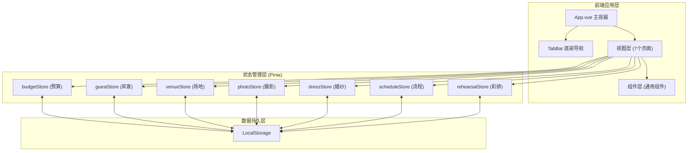
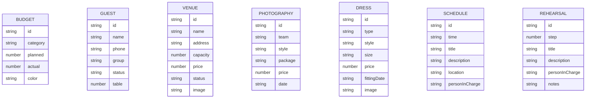

## 1. 架构设计



## 2. 技术描述
- **前端框架**: Vue@3.4 + 组合式API (Composition API)
- **构建工具**: Vite@5
- **样式方案**: TailwindCSS@3
- **状态管理**: Pinia@2 (模块化 store slices)
- **图表库**: ECharts@5 (饼图展示)
- **图标库**: unplugin-icons + iconify/vue (按需引入)
- **数据持久化**: localStorage 本地存储
- **动画**: Vue Transition + CSS Animation
- **数据来源**: 前端 Mock 数据，无需后端

## 3. 路由定义
使用 Vue Router 管理页面路由，通过底部 Tab 切换。

| 路由路径 | 页面组件 | 模块名称 |
|----------|----------|----------|
| / | BudgetView | 预算模块 (默认) |
| /budget | BudgetView | 预算模块 |
| /guests | GuestsView | 宾客模块 |
| /venues | VenuesView | 场地模块 |
| /photography | PhotographyView | 摄影模块 |
| /dress | DressView | 婚纱模块 |
| /schedule | ScheduleView | 流程模块 |
| /rehearsal | RehearsalView | 彩排模块 |

## 4. 数据模型

### 4.1 数据模型定义


### 4.2 目录结构
```
src/
├── main.js                    # 入口文件
├── App.vue                    # 根组件
├── router/
│   └── index.js               # 路由配置
├── stores/                    # Pinia store slices
│   ├── budget.js
│   ├── guests.js
│   ├── venues.js
│   ├── photography.js
│   ├── dress.js
│   ├── schedule.js
│   └── rehearsal.js
├── views/                     # 页面视图
│   ├── BudgetView.vue
│   ├── GuestsView.vue
│   ├── VenuesView.vue
│   ├── PhotographyView.vue
│   ├── DressView.vue
│   ├── ScheduleView.vue
│   └── RehearsalView.vue
├── components/                # 通用组件
│   ├── TabBar.vue
│   ├── PieChart.vue
│   └── Timeline.vue
├── data/                      # Mock 数据
│   └── mockData.js
├── assets/                    # 静态资源
│   └── images/
├── styles/                    # 全局样式
│   └── main.css
└── utils/                     # 工具函数
    └── storage.js
```

## 5. 核心技术点
1. **Store Slice 模式**: 每个模块独立 Pinia store，封装状态、actions、getters
2. **组件化设计**: 饼图、时间轴、TabBar 等可复用组件单独封装
3. **响应式布局**: Tailwind 断点适配，移动端优先
4. **过渡动画**: Vue Transition 实现 Tab 切换和列表项进入动画
5. **本地持久化**: 自动同步 store 数据到 localStorage
6. **按需加载**: Vue Router 路由懒加载，ECharts 按需引入
